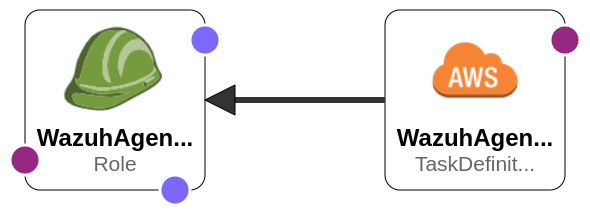

## WAZUH Agent AWS Fargate

## WAZUH Agent Docker RUN Description

Wazuh Agent as Docker Image.

simple way of running the container

    docker run --rm kkpkishan/wazuh-agent:4.3.10-1-dev

advanced usage

    docker run -d --name wazuh -v /:/rootfs:ro --net host --hostname ${HOSTNAME} \
      -e JOIN_MANAGER=172.17.0.1 -e JOIN_GROUPS=default \
      -v /etc/os-release:/etc/os-release \
      -v /var/run/docker.sock:/var/run/docker.sock \
      -v /var/ossec/ossec.conf:/var/ossec/etc/ossec.conf \
      -v /var/ossec/local_internal_options.conf:/var/ossec/etc/local_internal_options.conf \
      -v /var/ossec/client.keys:/var/ossec/etc/client.keys kkpkishan/wazuh-agent:4.3.10-1-dev
#### wazuh-kubernetes
    deployment kubernetes-wazuh-agent.yaml files for kubernetes on  cluster.

    kubectl create ns logging
    kubectl apply -f kubernetes-wazuh-agent.yaml

#### wazuh-aws-ecs
    deployment ecs-task.yaml files for AWS ECS on CloudFormation.

    aws-ecs-task.yaml
#### Source

https://github.com/kkpkishan/wazuh-agent.git    
